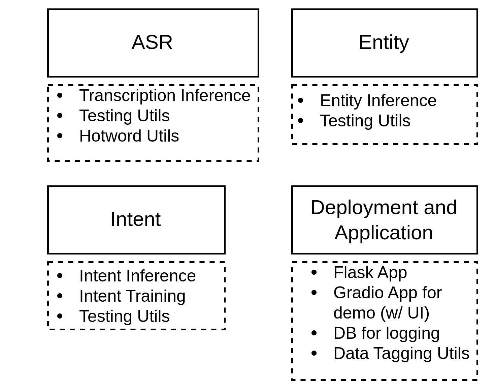
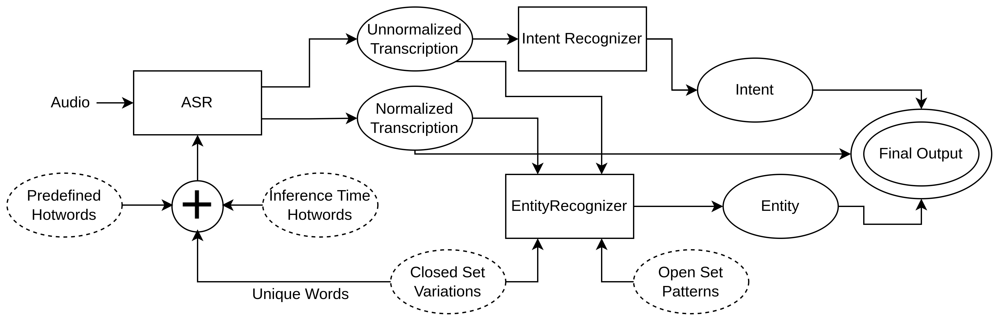

<h1 align="center">Transcational Voice AI</h1>

<p align="center">Transcational Voice AI is a library for building voice assistants by combining ASR, Intent recognition and Entity prediction. This library can be used for training models and building predictors to support voice assistants. The final pipeline takes audio as input and returns the predicted transcription, intent and entities corresponding to the input. The pipeline can be integrated with conversational logic to build end-to-end voice assistants.</p>
<p align="center">
  For more info on the Transactional Voice AI deployment codebase, refer <a href="https://github.com/AI4Bharat/transactional-voice-ai_serving">here</a>.
</p>

## Setup
1. Clone the repository
```
git clone https://github.com/AI4Bharat/transactional-voice-ai.git
```
2. Import the conda environment and activate
```
conda env create -n dev-env --file conda-env-setup.yaml
conda activate dev-env
```
3. Clone the [indic-punct](https://github.com/AI4Bharat/indic-punct) library (outside the transactional voice ai folder).
Follow the [installation instructions](https://github.com/AI4Bharat/indic-punct#installation-instructions) to setup indic-punct.
4. Fetch the model and data files using git-lfs command: `git lfs fetch --all`

## Structure
The project contains four modules as shown in the image. 
<br>

<br>
Note: Deployment utils provided here are not production ready. For deployment, use [transactional-voice-ai_serving](https://github.com/AI4Bharat/transactional-voice-ai_serving).

The individual components are defined in detail in the following faces:
- ASR (+ Hotwords, LM, ITN)
- [Intent](intent/README.md)
- [Entity](entity/README.md)

## Pipeline
The complete pipeline integrating the components is given in the following diagram.
<br>

<br>
This pipeline is implemented in [pipeline.py](pipeline.py) and also on [transactional-voice-ai_serving](https://github.com/AI4Bharat/transactional-voice-ai_serving).

