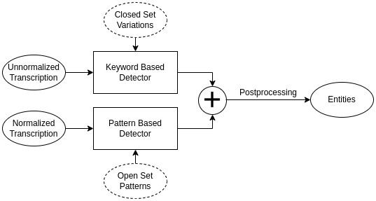

# Transactional Voice AI - Intent

<br>
The entity recognizer is a deterministic pattern recognition system that uses regex patterns to search the ASR transcripts for certain words, phrases or patterns, which correspond to entities. Two kinds of entities:

- <b>Closed Set Entities</b>- Entities that have a finite number of values (e.g. bank name)
- <b>Open Set Entities</b>- Entities that have infinite values but follow some pattern (e.g. mobile number)
Note: Current setup doesn't support entities that do not fall under the open or closed definition, e.g. `datetime`.

Every predicted entity is represented as a dictionary with the following key-values:
```
entity: Type of entity (bank name)
word: The substring of input text corresponding to the entity
value: The instance of entity detected
start: Start index of the entity in the input text
end: End index of the entity in the input text
```
The final prediction is a list of dictionaries.

## Closed Set Entities
These are predicted using a regex-based keyword search. All the variations which correspond to the supported entities need to be defined in the YAML files under `entity/data/variations`. The schema for the YAML is given below:
```yaml
entity_type_1:
    entity_val_1a:
        - <variation>
        - <variation>
        - <variation>
    entity_val_1b:
        - <variation>

entity_type_2:
    entity_val_2a:
        - <variation>
        - <variation>
```

## Open Set Entities
These are predicted using a regex pattern-based search. All the patterns which correspond to the supported entities need to be defined in `entity/data/patterns.yaml`. The schema for the YAML is given below:
```yaml
entity_type_1:
    - <pattern>
    - <pattern>
    - <pattern>
entity_type_2:
    - <pattern>
```

## Prediction
`EntityRecognizer` defined in `entity_recognizer.py` takes care of prediction for both types of entities. Additionally, it performs some postprocessing on the predicted entities for removing ambiguities and applying standardization.

## Adding new entities
For supporting new entities, add the variations or patterns for open or closed type in the corresponding YAML files.
<br>
For supporting new languages, add new patterns to open set definitions and create a new language corresponding YAML file for closed set variations.
