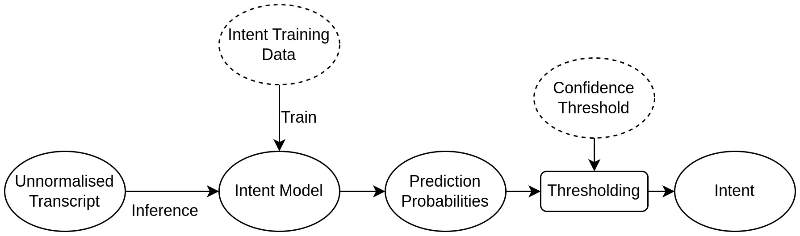

# Transactional Voice AI - Intent

<br>
The intent recognizer is a classifier that uses an [IndicBERT](https://github.com/AI4Bharat/IndicBERT) for sequence classification
using huggingface. This classifier is trained on a dataset of text-intent samples. Along with the intents required for the supported use cases, an additional `unknown` intent is also supported to classify low-confidence predictions or out-of-scope cases. Since IndicBERT is a multilingual model, a single model is used for all languages, rather than having different models for each language.


## Training
Use the following script for training:
```
python intent/train_intent.py --train-data <path_to_data_csv> --output-dir <path_to_dir_to_save_model> --epochs <number_of_training_epochs>
```

## Data
The current iteration of the data is provided in `data/all-lang/`.
The training data for the intent model needs to be a CSV with the columns:
```
Text: The input sentence
Label: Corresponding intent
```
An additional `Lang` column can be stored for convenience, but it is not required for training. The dataset file follows the schema:
| Text        | Label           | Lang  |
| ------------- |:-------------:| -----:|
| transfer 100 rupees | p2p_transfer | en |
| मेरे खाते की शेष राशि क्या है | balance_check | hi |
| ମୋ ବ୍ୟାଙ୍କ ଆକାଉଣ୍ଟରୁ 20 ଟଙ୍କା ସ୍ଥାନାନ୍ତର କରନ୍ତୁ | p2p_transfer | or |

Note: Current dataset does not contain samples for `unknown` intent and the model is not trained to predict `unknown`. A confidence threshold with a high value of `0.85` is used to predict `unknown`.

## Models
The current iteration of the trained model can be found at `models/all-lang-all/`

## Adding new intent
For supporting a new intent, add data for corresponding intent into the training data CSV file and train a new model. For supporting a new language, add data corresponding to all intents in the new language to the training data CSV file and train a new model.